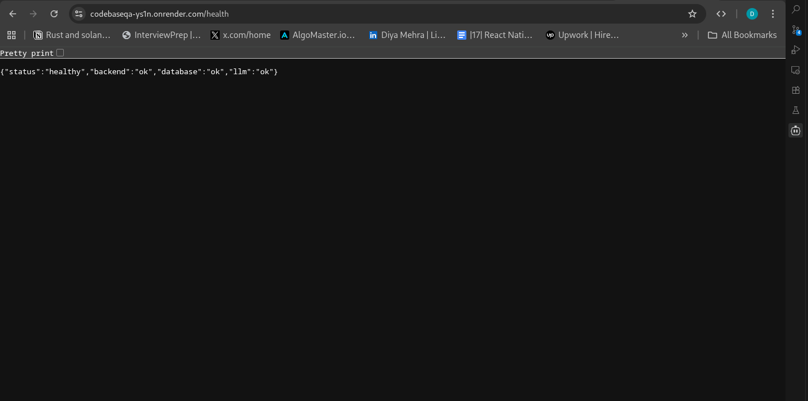

# CodeBaseQA

A powerful tool to navigate and understand your codebase using AI. This application allows users to ingest GitHub repositories, ask questions about the code, and receive context-aware answers with citations.

## How to Run

### Backend

1. Navigate to the backend directory:
   ```bash
   cd backend
   ```
2. Create a virtual environment (optional but recommended):
   ```bash
   python -m venv venv
   source venv/bin/activate  # On Windows: venv\Scripts\activate
   ```
3. Install dependencies:
   ```bash
   pip install -r requirements.txt
   ```
4. Set up environment variables (create a `.env` file based on `.env.example` if available, or ensure `GROQ_API_KEY` is set).
5. Run the server:
   ```bash
   python main.py
   ```
   The backend will start at `http://localhost:8000`.

### Frontend

1. Navigate to the frontend directory:
   ```bash
   cd frontend
   ```
2. Install dependencies:
   ```bash
   npm install
   ```
3. Run the development server:
   ```bash
   npm run dev
   ```
   The frontend will be available at `http://localhost:3000`.

## Usage Guide

For detailed step-by-step instructions on how to use the application, please refer to [STEPS.md](STEPS.md).

## What is Done

- **GitHub Ingestion:** Ability to clone and process GitHub repositories.
- **Code Analysis:** Chunking and vectorization of code files for efficient search.
- **AI-Powered Q&A:** Context-aware answers using Groq's Llama-3.1 model.
- **Proof Viewer:** Interactive display of source code citations with line highlighting.
- **Conversation History:** Maintains context across multiple queries in a session.
- **Responsive UI:** Modern, clean interface built with Next.js and Tailwind CSS.

## System Health Check

You can verify the status of the backend, database, and LLM connection by visiting the `/health` endpoint.



## What is Not Done

- **Local File Upload:** Currently supports only GitHub URLs.
- **User Authentication:** No login system or multi-user support yet.
- **Persistent Database:** Session history is currently limited to the runtime/session service implementation (check implementation details).
- **Advanced Analytics:** No dashboard for usage stats or query analysis.
